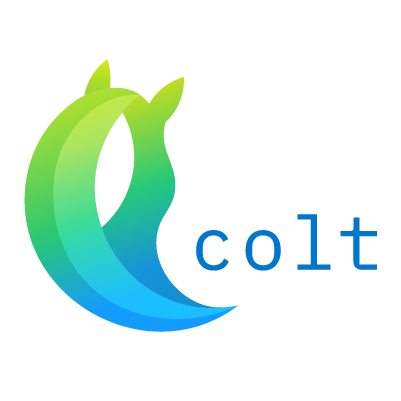

*** This project is currently in progress. *** 

# COLT - COmmand Line Translation
Colt is a command line tool that allows a developer to automate strings translations for localization. It will parse your existing file(s), translate each string to your desired language, and save them into a new file. This can be a tool for developers who do not have the resources to hire a translator, yet want to make their apps more accessible. Or, for those simply curious at how their app would look in a different language.

### SYSTRAN.io
Colt uses the SYSTRAN.io api for translation. A list of supported language pairs can be found here, under the Machine Translation section. https://platform.systran.net/index (FYI, if wanting to translate to Chinese, you must use the code "zh-Hans" with a capital H. It is not listed like this in the pairs supported pairs list.)

There is a disclaimer of "SYSTRAN Platform is free for small volumes and testing purposes, monthly subscriptions are available for higher volumes", however with all my testing I never hit this limit. I'm banking on your project not including Les Misérables (although maybe it should).
